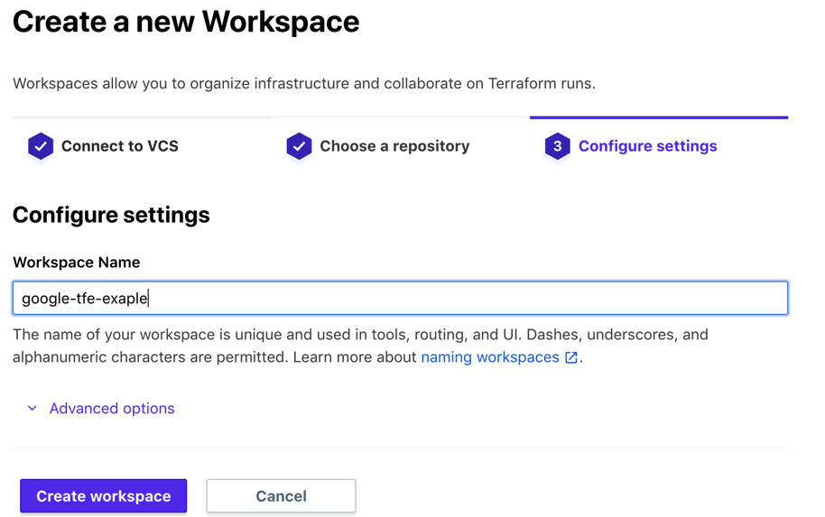
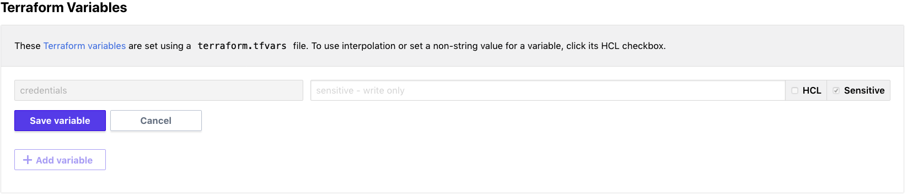

# Sample terraform code to show how to use google cloud provider with Terraform Cloud

### When you use Terraform cloud - Create Terraform Dedicated service accounts to authenticate with Google Cloud Platform

## Prerequisites

- git
- Subscription with Terraform Enterprise SaaS
- Subscription with Google Cloud Platform

## How to use

- Fork the repo
- Log in to Terraform Cloud
- Add new VCS provider for GitHub if still dont't have one configured (`For more details on how to integrate Terraform Cloud with your version control system (VCS) provider please refer to` [terraform documentation](https://www.terraform.io/docs/enterprise/vcs/github.html)
- Create new workspace and connect it to Version Control with GitHub VCS provider selecting the forked repo

&nbsp;

- Create `Terraform-specific service account` on GCP to use to authenticate with Google Cloud Platform (Check documentaion for instrucions on [creating service account](https://cloud.google.com/docs/authentication/getting-started) on GCP)
- Get the `credential service account` as a json file
- Add a new `sensitive` variable `credentials` as `terraform variables` in Terraform Cloud and set its value be the content of your credentials json file

&nbsp;


## How to test

- Go to Terraform Enterprise UI
- Select workspace `google-tfe-exaple`
- Run `Plan and Apply`

#### You should see and output that contains the following message:

```
Hello GCP! Google provider is properly configured and authentication is working fine.
```
